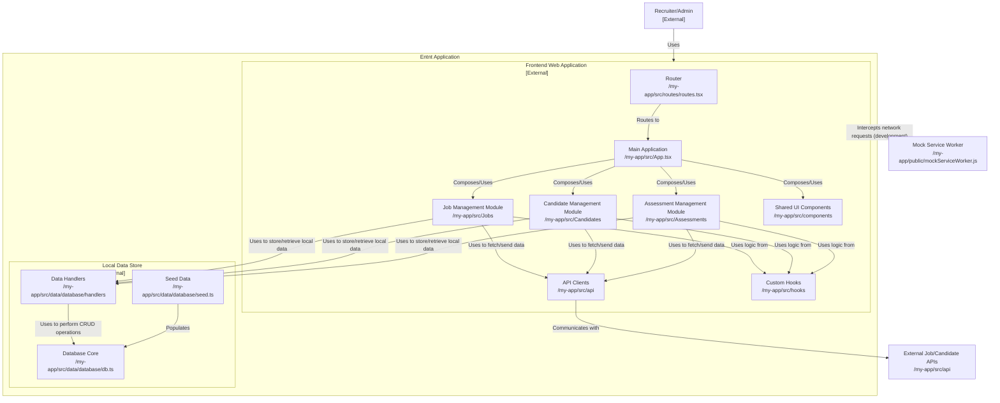

# Unnamed CodeViz Diagram

```mermaid
graph TD

    user["Recruiter/Admin<br>[External]"]
    external_apis["External Job/Candidate APIs<br>/my-app/src/api"]
    mock_service_worker["Mock Service Worker<br>/my-app/public/mockServiceWorker.js"]
    subgraph entnt_app_boundary["Entnt Application<br>[External]"]
        subgraph frontend_app_boundary["Frontend Web Application<br>[External]"]
            router["Router<br>/my-app/src/routes/routes.tsx"]
            main_app["Main Application<br>/my-app/src/App.tsx"]
            job_management["Job Management Module<br>/my-app/src/Jobs"]
            candidate_management["Candidate Management Module<br>/my-app/src/Candidates"]
            assessment_management["Assessment Management Module<br>/my-app/src/Assessments"]
            api_clients["API Clients<br>/my-app/src/api"]
            shared_ui["Shared UI Components<br>/my-app/src/components"]
            custom_hooks["Custom Hooks<br>/my-app/src/hooks"]
            %% Edges at this level (grouped by source)
            router["Router<br>/my-app/src/routes/routes.tsx"] -->|"Routes to"| main_app["Main Application<br>/my-app/src/App.tsx"]
            main_app["Main Application<br>/my-app/src/App.tsx"] -->|"Composes/Uses"| job_management["Job Management Module<br>/my-app/src/Jobs"]
            main_app["Main Application<br>/my-app/src/App.tsx"] -->|"Composes/Uses"| candidate_management["Candidate Management Module<br>/my-app/src/Candidates"]
            main_app["Main Application<br>/my-app/src/App.tsx"] -->|"Composes/Uses"| assessment_management["Assessment Management Module<br>/my-app/src/Assessments"]
            main_app["Main Application<br>/my-app/src/App.tsx"] -->|"Composes/Uses"| shared_ui["Shared UI Components<br>/my-app/src/components"]
            job_management["Job Management Module<br>/my-app/src/Jobs"] -->|"Uses to fetch/send data"| api_clients["API Clients<br>/my-app/src/api"]
            job_management["Job Management Module<br>/my-app/src/Jobs"] -->|"Uses logic from"| custom_hooks["Custom Hooks<br>/my-app/src/hooks"]
            candidate_management["Candidate Management Module<br>/my-app/src/Candidates"] -->|"Uses to fetch/send data"| api_clients["API Clients<br>/my-app/src/api"]
            candidate_management["Candidate Management Module<br>/my-app/src/Candidates"] -->|"Uses logic from"| custom_hooks["Custom Hooks<br>/my-app/src/hooks"]
            assessment_management["Assessment Management Module<br>/my-app/src/Assessments"] -->|"Uses to fetch/send data"| api_clients["API Clients<br>/my-app/src/api"]
            assessment_management["Assessment Management Module<br>/my-app/src/Assessments"] -->|"Uses logic from"| custom_hooks["Custom Hooks<br>/my-app/src/hooks"]
        end
        subgraph local_data_store_boundary["Local Data Store<br>[External]"]
            db_core["Database Core<br>/my-app/src/data/database/db.ts"]
            data_handlers["Data Handlers<br>/my-app/src/data/database/handlers"]
            seed_data["Seed Data<br>/my-app/src/data/database/seed.ts"]
            %% Edges at this level (grouped by source)
            data_handlers["Data Handlers<br>/my-app/src/data/database/handlers"] -->|"Uses to perform CRUD operations"| db_core["Database Core<br>/my-app/src/data/database/db.ts"]
            seed_data["Seed Data<br>/my-app/src/data/database/seed.ts"] -->|"Populates"| db_core["Database Core<br>/my-app/src/data/database/db.ts"]
        end
        %% Edges at this level (grouped by source)
        job_management["Job Management Module<br>/my-app/src/Jobs"] -->|"Uses to store/retrieve local data"| data_handlers["Data Handlers<br>/my-app/src/data/database/handlers"]
        candidate_management["Candidate Management Module<br>/my-app/src/Candidates"] -->|"Uses to store/retrieve local data"| data_handlers["Data Handlers<br>/my-app/src/data/database/handlers"]
        assessment_management["Assessment Management Module<br>/my-app/src/Assessments"] -->|"Uses to store/retrieve local data"| data_handlers["Data Handlers<br>/my-app/src/data/database/handlers"]
    end
    %% Edges at this level (grouped by source)
    api_clients["API Clients<br>/my-app/src/api"] -->|"Communicates with"| external_apis["External Job/Candidate APIs<br>/my-app/src/api"]
    user["Recruiter/Admin<br>[External]"] -->|"Uses"| frontend_app_boundary["Frontend Web Application<br>[External]"]
    frontend_app_boundary["Frontend Web Application<br>[External]"] -->|"Intercepts network requests (development)"| mock_service_worker["Mock Service Worker<br>/my-app/public/mockServiceWorker.js"]

```
---
*Generated by [CodeViz.ai](https://codeviz.ai) on 9/24/2025, 1:56:48 PM*
